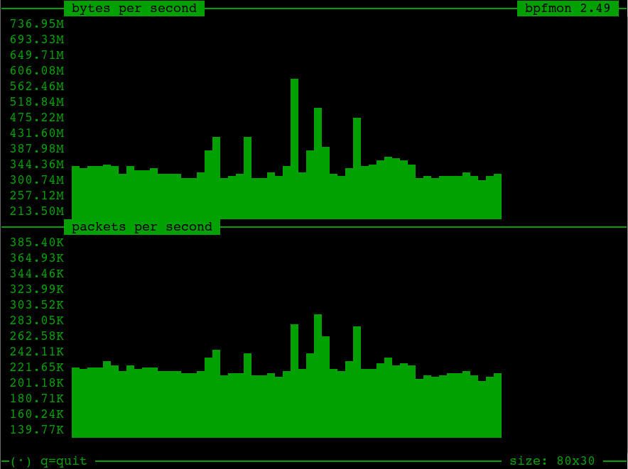

# bpfmon
BPF based visual packet rate monitor

While **tcpdump** shows _what_ packets are going through the network, bpfmon will show _how much_ in terms of bytes per second and packets per second in a nice pseudo-graphical terminal interface.

**bpfmon** also supports monitoring an iptables rule that is selected by command line option or selected from a menu (only under Linux).

**bpfmon** is licensed GPL-2.0+

## Sample screenshot

## How to install from binary package

Many Linux distributions already include this program under the name **bpfmon**.

If your distribution is relatively new, chances are that it already has **bpfmon** packaged. Follow these instructions.

In case it is not available, follow the [How to build from source](#how-to-build-from-source) instructions.

  
Debian/Devuan/Ubuntu/other derivatives

&nbsp;  

Use the following command (note that `-y` disables confirmation prompts):
  
    sudo apt install bpfmon -y

  
Fedora

&nbsp;  

Use the following command (note that `-y` disables confirmation prompts):
  
    sudo dnf install bpfmon -y

  
CentOS 7/CentOS 8/RHEL 7/RHEL 8

&nbsp;  

Use the following commands (note that `-y` disables confirmation prompts):
    
    sudo yum install epel-release -y
    sudo yum install bpfmon -y

## How to build from source
Please note that the installation and the usage of this program require root access.
**bpfmon** requires the [**yascreen** library](https://github.com/bbonev/yascreen)

  
Debian/Devuan/Ubuntu/other derivatives

&nbsp;  

Use the following commands (note that `-y` disables confirmation prompts):
  
    sudo apt install git build-essential pkg-config -y
    git clone https://github.com/bbonev/yascreen
    cd yascreen
    make -j
    sudo make install
    cd ..
    git clone https://github.com/bbonev/bpfmon
    cd bpfmon
    make -j

Fedora

&nbsp;  

Use the following commands (note that `-y` disables confirmation prompts):

    sudo dnf install git gcc make pkgconfig -y
    git clone https://github.com/bbonev/yascreen
    cd yascreen
    make -j
    sudo make install
    cd ..
    git clone https://github.com/bbonev/bpfmon
    cd bpfmon
    make -j

CentOS 7/CentOS 8/RHEL 7/RHEL 8

&nbsp;  

Use the following commands (note that `-y` disables confirmation prompts):

    sudo yum install git gcc make pkgconfig -y
    git clone https://github.com/bbonev/yascreen
    cd yascreen
    make -j
    sudo make install
    cd ..
    git clone https://github.com/bbonev/bpfmon
    cd bpfmon
    make -j

### How to install as a system command

    sudo make install

